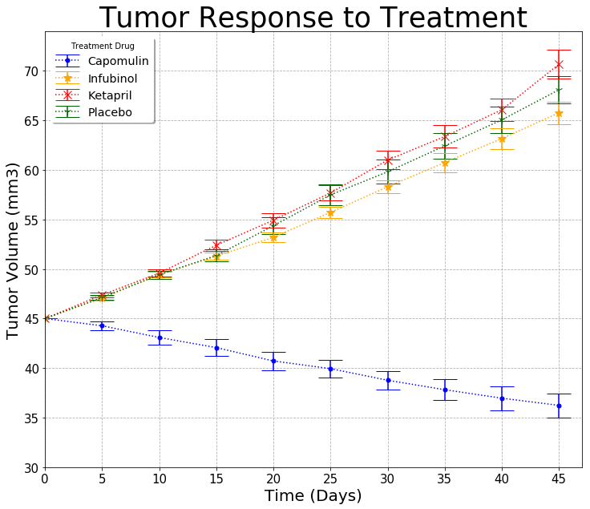
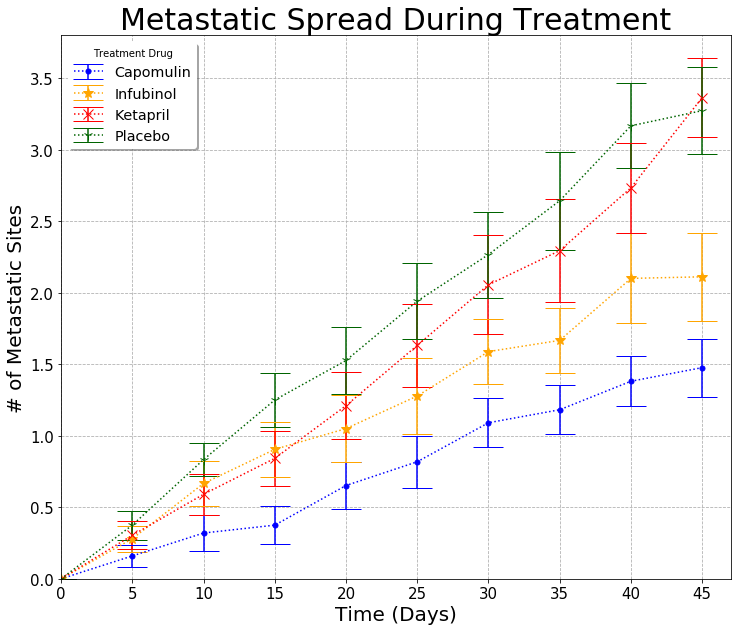
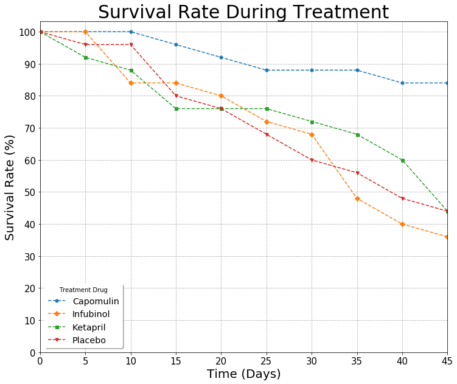
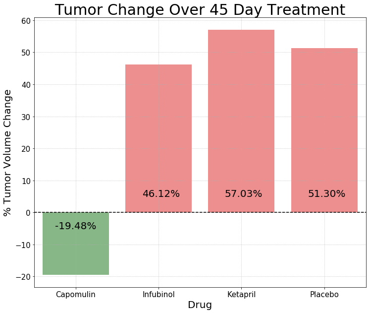

# Pymaceuticals Inc. Analysis

### Observable Trends
Compared to Infubinol, Ketapril, and Placebo, the drug efficacy of Capomulin can be deduced by the following observable trends derived the data analysis:
1. The observable trend for the placebo compared to the other drugs supports Capomulin's true efficacy against squamous cell carcinoma (SCC) in mice.
2. Capomulin's average decrease in tumor volume (mm3) by 19.48% and comparatively higher survival rate makes it a better treatment drug choice in mice.
3. Capomulin's effectiveness in decreasing tumor volume is correlated with a comparatively higher survival rate. However, the number of metastatic sites still continued to increase throughtout the treatment period. Despite capomulin's inability to stop the continuous growth of metastatic sites, capomulin's affect on the mouse's survival rate supports it's possible future use as a feature for future drug studies and drug designs.


```python
#import the modules used in this analysis
import pandas as pd 
import seaborn as sns
import matplotlib.pyplot as plt
import numpy as np
from scipy import stats

```


```python
#load and merge two datasets: Clinical Trial Data and Mouse Drug Data
clinicalTrial_data = pd.read_csv("clinicaltrial_data.csv")
mouse_drug_data = pd.read_csv("mouse_drug_data.csv")

#calculate the number of unique mouses treated 
num_unique_mouse = len(clinicalTrial_data["Mouse ID"].unique())
print(f"Total of {num_unique_mouse} unique mouses were treated in the cancer drug treatment study.")
```

    Total of 249 unique mouses were treated in the cancer drug treatment study.
    


```python
#merge datasets and sort values by treatment time and metastatic sites
merged_df = pd.merge(clinicalTrial_data, mouse_drug_data, how="left", on="Mouse ID")

#sort dataframe at treatment time and metastatic sites to starting from initial
df = merged_df.sort_values(by=["Timepoint", "Metastatic Sites"])

#sample view of the constructed dataframe
df.head(10)

```


<div>
<style scoped>
    .dataframe tbody tr th:only-of-type {
        vertical-align: middle;
    }

    .dataframe tbody tr th {
        vertical-align: top;
    }

    .dataframe thead th {
        text-align: right;
    }
</style>
<table border="1" class="dataframe">
  <thead>
    <tr style="text-align: right;">
      <th></th>
      <th>Mouse ID</th>
      <th>Timepoint</th>
      <th>Tumor Volume (mm3)</th>
      <th>Metastatic Sites</th>
      <th>Drug</th>
    </tr>
  </thead>
  <tbody>
    <tr>
      <th>0</th>
      <td>b128</td>
      <td>0</td>
      <td>45.0</td>
      <td>0</td>
      <td>Capomulin</td>
    </tr>
    <tr>
      <th>1</th>
      <td>f932</td>
      <td>0</td>
      <td>45.0</td>
      <td>0</td>
      <td>Ketapril</td>
    </tr>
    <tr>
      <th>2</th>
      <td>g107</td>
      <td>0</td>
      <td>45.0</td>
      <td>0</td>
      <td>Ketapril</td>
    </tr>
    <tr>
      <th>3</th>
      <td>a457</td>
      <td>0</td>
      <td>45.0</td>
      <td>0</td>
      <td>Ketapril</td>
    </tr>
    <tr>
      <th>4</th>
      <td>c819</td>
      <td>0</td>
      <td>45.0</td>
      <td>0</td>
      <td>Ketapril</td>
    </tr>
    <tr>
      <th>5</th>
      <td>h246</td>
      <td>0</td>
      <td>45.0</td>
      <td>0</td>
      <td>Ketapril</td>
    </tr>
    <tr>
      <th>6</th>
      <td>p189</td>
      <td>0</td>
      <td>45.0</td>
      <td>0</td>
      <td>Ketapril</td>
    </tr>
    <tr>
      <th>7</th>
      <td>n923</td>
      <td>0</td>
      <td>45.0</td>
      <td>0</td>
      <td>Ketapril</td>
    </tr>
    <tr>
      <th>8</th>
      <td>q119</td>
      <td>0</td>
      <td>45.0</td>
      <td>0</td>
      <td>Ketapril</td>
    </tr>
    <tr>
      <th>9</th>
      <td>f993</td>
      <td>0</td>
      <td>45.0</td>
      <td>0</td>
      <td>Naftisol</td>
    </tr>
  </tbody>
</table>
</div>


# Tumor Response to Treatment


```python
#--------------------------------------------------


#Creating a scatter plot that shows how the tumor volume  
#changes over time for each treatment


#--------------------------------------------------


```


```python
#manipulate dataframe down to displaying on "Drug", "Timepoint", and
#"Tumor Volume (mm3)" data values
filtered1_df = df[["Drug", "Timepoint", "Tumor Volume (mm3)"]]


#manipulate dataframe to display average Tumor Volume(mm3)
#for each drug at each treatment time
a = filtered1_df.groupby(["Drug", "Timepoint"]).mean()

#sample display of the constructed dataframe
a.head(10)
```


<div>
<style scoped>
    .dataframe tbody tr th:only-of-type {
        vertical-align: middle;
    }

    .dataframe tbody tr th {
        vertical-align: top;
    }

    .dataframe thead th {
        text-align: right;
    }
</style>
<table border="1" class="dataframe">
  <thead>
    <tr style="text-align: right;">
      <th></th>
      <th></th>
      <th>Tumor Volume (mm3)</th>
    </tr>
    <tr>
      <th>Drug</th>
      <th>Timepoint</th>
      <th></th>
    </tr>
  </thead>
  <tbody>
    <tr>
      <th rowspan="10" valign="top">Capomulin</th>
      <th>0</th>
      <td>45.000000</td>
    </tr>
    <tr>
      <th>5</th>
      <td>44.266086</td>
    </tr>
    <tr>
      <th>10</th>
      <td>43.084291</td>
    </tr>
    <tr>
      <th>15</th>
      <td>42.064317</td>
    </tr>
    <tr>
      <th>20</th>
      <td>40.716325</td>
    </tr>
    <tr>
      <th>25</th>
      <td>39.939528</td>
    </tr>
    <tr>
      <th>30</th>
      <td>38.769339</td>
    </tr>
    <tr>
      <th>35</th>
      <td>37.816839</td>
    </tr>
    <tr>
      <th>40</th>
      <td>36.958001</td>
    </tr>
    <tr>
      <th>45</th>
      <td>36.236114</td>
    </tr>
  </tbody>
</table>
</div>


```python
#reset index to bring drug and timepoint indices back into dataframe as columns
reset_a = a.reset_index()

#construct dataframe as tumor volume (mm3) series with multiindex
series = pd.Series(list(a["Tumor Volume (mm3)"]), index=[reset_a["Drug"], reset_a["Timepoint"]])

#use unstack() and T method to construct desired dataframe 
#displays treatment time as index, and treatment drug as column
#to see the change in tumor volume over the treatment period
unstacked_drug_timepoint_df = series.unstack().T
unstacked_drug_timepoint_df

```


<div>
<style scoped>
    .dataframe tbody tr th:only-of-type {
        vertical-align: middle;
    }

    .dataframe tbody tr th {
        vertical-align: top;
    }

    .dataframe thead th {
        text-align: right;
    }
</style>
<table border="1" class="dataframe">
  <thead>
    <tr style="text-align: right;">
      <th>Drug</th>
      <th>Capomulin</th>
      <th>Ceftamin</th>
      <th>Infubinol</th>
      <th>Ketapril</th>
      <th>Naftisol</th>
      <th>Placebo</th>
      <th>Propriva</th>
      <th>Ramicane</th>
      <th>Stelasyn</th>
      <th>Zoniferol</th>
    </tr>
    <tr>
      <th>Timepoint</th>
      <th></th>
      <th></th>
      <th></th>
      <th></th>
      <th></th>
      <th></th>
      <th></th>
      <th></th>
      <th></th>
      <th></th>
    </tr>
  </thead>
  <tbody>
    <tr>
      <th>0</th>
      <td>45.000000</td>
      <td>45.000000</td>
      <td>45.000000</td>
      <td>45.000000</td>
      <td>45.000000</td>
      <td>45.000000</td>
      <td>45.000000</td>
      <td>45.000000</td>
      <td>45.000000</td>
      <td>45.000000</td>
    </tr>
    <tr>
      <th>5</th>
      <td>44.266086</td>
      <td>46.503051</td>
      <td>47.062001</td>
      <td>47.389175</td>
      <td>46.796098</td>
      <td>47.125589</td>
      <td>47.248967</td>
      <td>43.944859</td>
      <td>47.527452</td>
      <td>46.851818</td>
    </tr>
    <tr>
      <th>10</th>
      <td>43.084291</td>
      <td>48.285125</td>
      <td>49.403909</td>
      <td>49.582269</td>
      <td>48.694210</td>
      <td>49.423329</td>
      <td>49.101541</td>
      <td>42.531957</td>
      <td>49.463844</td>
      <td>48.689881</td>
    </tr>
    <tr>
      <th>15</th>
      <td>42.064317</td>
      <td>50.094055</td>
      <td>51.296397</td>
      <td>52.399974</td>
      <td>50.933018</td>
      <td>51.359742</td>
      <td>51.067318</td>
      <td>41.495061</td>
      <td>51.529409</td>
      <td>50.779059</td>
    </tr>
    <tr>
      <th>20</th>
      <td>40.716325</td>
      <td>52.157049</td>
      <td>53.197691</td>
      <td>54.920935</td>
      <td>53.644087</td>
      <td>54.364417</td>
      <td>53.346737</td>
      <td>40.238325</td>
      <td>54.067395</td>
      <td>53.170334</td>
    </tr>
    <tr>
      <th>25</th>
      <td>39.939528</td>
      <td>54.287674</td>
      <td>55.715252</td>
      <td>57.678982</td>
      <td>56.731968</td>
      <td>57.482574</td>
      <td>55.504138</td>
      <td>38.974300</td>
      <td>56.166123</td>
      <td>55.432935</td>
    </tr>
    <tr>
      <th>30</th>
      <td>38.769339</td>
      <td>56.769517</td>
      <td>58.299397</td>
      <td>60.994507</td>
      <td>59.559509</td>
      <td>59.809063</td>
      <td>58.196374</td>
      <td>38.703137</td>
      <td>59.826738</td>
      <td>57.713531</td>
    </tr>
    <tr>
      <th>35</th>
      <td>37.816839</td>
      <td>58.827548</td>
      <td>60.742461</td>
      <td>63.371686</td>
      <td>62.685087</td>
      <td>62.420615</td>
      <td>60.350199</td>
      <td>37.451996</td>
      <td>62.440699</td>
      <td>60.089372</td>
    </tr>
    <tr>
      <th>40</th>
      <td>36.958001</td>
      <td>61.467895</td>
      <td>63.162824</td>
      <td>66.068580</td>
      <td>65.600754</td>
      <td>65.052675</td>
      <td>63.045537</td>
      <td>36.574081</td>
      <td>65.356386</td>
      <td>62.916692</td>
    </tr>
    <tr>
      <th>45</th>
      <td>36.236114</td>
      <td>64.132421</td>
      <td>65.755562</td>
      <td>70.662958</td>
      <td>69.265506</td>
      <td>68.084082</td>
      <td>66.258529</td>
      <td>34.955595</td>
      <td>68.438310</td>
      <td>65.960888</td>
    </tr>
  </tbody>
</table>
</div>


```python
#reset index for dataframe to use timepoint as x-axis in chart 
unstacked_drug_timepoint = unstacked_drug_timepoint_df.reset_index()
unstacked_drug_timepoint
```


<div>
<style scoped>
    .dataframe tbody tr th:only-of-type {
        vertical-align: middle;
    }

    .dataframe tbody tr th {
        vertical-align: top;
    }

    .dataframe thead th {
        text-align: right;
    }
</style>
<table border="1" class="dataframe">
  <thead>
    <tr style="text-align: right;">
      <th>Drug</th>
      <th>Timepoint</th>
      <th>Capomulin</th>
      <th>Ceftamin</th>
      <th>Infubinol</th>
      <th>Ketapril</th>
      <th>Naftisol</th>
      <th>Placebo</th>
      <th>Propriva</th>
      <th>Ramicane</th>
      <th>Stelasyn</th>
      <th>Zoniferol</th>
    </tr>
  </thead>
  <tbody>
    <tr>
      <th>0</th>
      <td>0</td>
      <td>45.000000</td>
      <td>45.000000</td>
      <td>45.000000</td>
      <td>45.000000</td>
      <td>45.000000</td>
      <td>45.000000</td>
      <td>45.000000</td>
      <td>45.000000</td>
      <td>45.000000</td>
      <td>45.000000</td>
    </tr>
    <tr>
      <th>1</th>
      <td>5</td>
      <td>44.266086</td>
      <td>46.503051</td>
      <td>47.062001</td>
      <td>47.389175</td>
      <td>46.796098</td>
      <td>47.125589</td>
      <td>47.248967</td>
      <td>43.944859</td>
      <td>47.527452</td>
      <td>46.851818</td>
    </tr>
    <tr>
      <th>2</th>
      <td>10</td>
      <td>43.084291</td>
      <td>48.285125</td>
      <td>49.403909</td>
      <td>49.582269</td>
      <td>48.694210</td>
      <td>49.423329</td>
      <td>49.101541</td>
      <td>42.531957</td>
      <td>49.463844</td>
      <td>48.689881</td>
    </tr>
    <tr>
      <th>3</th>
      <td>15</td>
      <td>42.064317</td>
      <td>50.094055</td>
      <td>51.296397</td>
      <td>52.399974</td>
      <td>50.933018</td>
      <td>51.359742</td>
      <td>51.067318</td>
      <td>41.495061</td>
      <td>51.529409</td>
      <td>50.779059</td>
    </tr>
    <tr>
      <th>4</th>
      <td>20</td>
      <td>40.716325</td>
      <td>52.157049</td>
      <td>53.197691</td>
      <td>54.920935</td>
      <td>53.644087</td>
      <td>54.364417</td>
      <td>53.346737</td>
      <td>40.238325</td>
      <td>54.067395</td>
      <td>53.170334</td>
    </tr>
    <tr>
      <th>5</th>
      <td>25</td>
      <td>39.939528</td>
      <td>54.287674</td>
      <td>55.715252</td>
      <td>57.678982</td>
      <td>56.731968</td>
      <td>57.482574</td>
      <td>55.504138</td>
      <td>38.974300</td>
      <td>56.166123</td>
      <td>55.432935</td>
    </tr>
    <tr>
      <th>6</th>
      <td>30</td>
      <td>38.769339</td>
      <td>56.769517</td>
      <td>58.299397</td>
      <td>60.994507</td>
      <td>59.559509</td>
      <td>59.809063</td>
      <td>58.196374</td>
      <td>38.703137</td>
      <td>59.826738</td>
      <td>57.713531</td>
    </tr>
    <tr>
      <th>7</th>
      <td>35</td>
      <td>37.816839</td>
      <td>58.827548</td>
      <td>60.742461</td>
      <td>63.371686</td>
      <td>62.685087</td>
      <td>62.420615</td>
      <td>60.350199</td>
      <td>37.451996</td>
      <td>62.440699</td>
      <td>60.089372</td>
    </tr>
    <tr>
      <th>8</th>
      <td>40</td>
      <td>36.958001</td>
      <td>61.467895</td>
      <td>63.162824</td>
      <td>66.068580</td>
      <td>65.600754</td>
      <td>65.052675</td>
      <td>63.045537</td>
      <td>36.574081</td>
      <td>65.356386</td>
      <td>62.916692</td>
    </tr>
    <tr>
      <th>9</th>
      <td>45</td>
      <td>36.236114</td>
      <td>64.132421</td>
      <td>65.755562</td>
      <td>70.662958</td>
      <td>69.265506</td>
      <td>68.084082</td>
      <td>66.258529</td>
      <td>34.955595</td>
      <td>68.438310</td>
      <td>65.960888</td>
    </tr>
  </tbody>
</table>
</div>


```python
#below is to calculate the standard error for each time point for each drug treatment desired for analysis
#dataframe displaying "Drug", "Timepoint", and "Tumor Volume (mm3)" data values
filtered2_df = filtered1_df.sort_values(by=["Drug", "Timepoint"])


#function to create dataframe to display specific treatment drug
def volume_df(df, drug_choice):
    df = df.loc[df["Drug"]==drug_choice]
    del df["Drug"]
    return df


#function to create standard error for each treatment time 
def semArray(df):
    err = []
    for x in range(0, 50, 5):
        semSeries = df.loc[df["Timepoint"]==x].sem()
        err.append(semSeries["Tumor Volume (mm3)"])
    return err


#calculate the standard of error for each time period
capomulin_err = semArray(volume_df(filtered2_df, "Capomulin"))
infubinol_err = semArray(volume_df(filtered2_df, "Infubinol"))
ketapril_err = semArray(volume_df(filtered2_df, "Ketapril"))
placebo_err = semArray(volume_df(filtered2_df, "Placebo"))


```


```python

#set a specific size for the chart
plt.figure(figsize=(12,10))

#plot scttor plot with error bars showing the standard error for each point
plt.errorbar(x="Timepoint", y="Capomulin", data=unstacked_drug_timepoint, yerr=capomulin_err, 
             color = 'blue', marker='o', ms=5, linestyle=':', capsize=15)
plt.errorbar(x="Timepoint", y="Infubinol", data=unstacked_drug_timepoint, yerr=infubinol_err, 
             color = 'orange', marker='*', ms=10, linestyle=':', capsize=15)
plt.errorbar(x="Timepoint", y="Ketapril", data=unstacked_drug_timepoint, yerr=ketapril_err, 
             color = 'red', marker='x', ms=10, linestyle=':', capsize=15)
plt.errorbar(x="Timepoint", y="Placebo", data=unstacked_drug_timepoint, yerr=placebo_err, 
             color = 'darkgreen', marker="1", ms=10, linestyle=':', capsize=15)

#display gridlines on chart
plt.grid(linestyle="--")

#add title to chart
plt.title("Tumor Response to Treatment", size=35)

#adjust x-axis and y-axis of chart
plt.xticks(np.arange(0, 50, step=5), fontsize=15)
plt.yticks(np.arange(30, 75, step=5), fontsize=15)
plt.xlim(0,47)

#add x-axis and y-axis labels, and a legend
plt.xlabel("Time (Days)", fontsize=20)
plt.ylabel("Tumor Volume (mm3)", fontsize=20)
plt.legend(loc='best', shadow=True, title="Treatment Drug", fontsize='x-large')
```


    <matplotlib.legend.Legend at 0x1dfb5b571d0>





# Metastatic Response to Treatment


```python
#--------------------------------------------------

#Creating a scatter plot that shows how the number of metastatic 
#(cancer spreading) sites changes over time for each treatment

#--------------------------------------------------


#filter dataframe to display only treatment drug, treatment time, 
#and number of metastatic sites
filtered_metastatic = df[["Drug", "Timepoint", "Metastatic Sites"]]

#calculate the average metastatic sites for each treatment time period for each treatment drug
grouped_filtered_metastatic = filtered_metastatic.groupby(["Drug", "Timepoint"]).mean()

#sample display of dataframe of average metastatic sites for each drug treatment
grouped_filtered_metastatic.head(10)

```


<div>
<style scoped>
    .dataframe tbody tr th:only-of-type {
        vertical-align: middle;
    }

    .dataframe tbody tr th {
        vertical-align: top;
    }

    .dataframe thead th {
        text-align: right;
    }
</style>
<table border="1" class="dataframe">
  <thead>
    <tr style="text-align: right;">
      <th></th>
      <th></th>
      <th>Metastatic Sites</th>
    </tr>
    <tr>
      <th>Drug</th>
      <th>Timepoint</th>
      <th></th>
    </tr>
  </thead>
  <tbody>
    <tr>
      <th rowspan="10" valign="top">Capomulin</th>
      <th>0</th>
      <td>0.000000</td>
    </tr>
    <tr>
      <th>5</th>
      <td>0.160000</td>
    </tr>
    <tr>
      <th>10</th>
      <td>0.320000</td>
    </tr>
    <tr>
      <th>15</th>
      <td>0.375000</td>
    </tr>
    <tr>
      <th>20</th>
      <td>0.652174</td>
    </tr>
    <tr>
      <th>25</th>
      <td>0.818182</td>
    </tr>
    <tr>
      <th>30</th>
      <td>1.090909</td>
    </tr>
    <tr>
      <th>35</th>
      <td>1.181818</td>
    </tr>
    <tr>
      <th>40</th>
      <td>1.380952</td>
    </tr>
    <tr>
      <th>45</th>
      <td>1.476190</td>
    </tr>
  </tbody>
</table>
</div>


```python
#manipulate dataframe to show the change in metastatic sites over treatment period
transposed_metastatic = grouped_filtered_metastatic.unstack().T
transposed_metastatic
```


<div>
<style scoped>
    .dataframe tbody tr th:only-of-type {
        vertical-align: middle;
    }

    .dataframe tbody tr th {
        vertical-align: top;
    }

    .dataframe thead th {
        text-align: right;
    }
</style>
<table border="1" class="dataframe">
  <thead>
    <tr style="text-align: right;">
      <th></th>
      <th>Drug</th>
      <th>Capomulin</th>
      <th>Ceftamin</th>
      <th>Infubinol</th>
      <th>Ketapril</th>
      <th>Naftisol</th>
      <th>Placebo</th>
      <th>Propriva</th>
      <th>Ramicane</th>
      <th>Stelasyn</th>
      <th>Zoniferol</th>
    </tr>
    <tr>
      <th></th>
      <th>Timepoint</th>
      <th></th>
      <th></th>
      <th></th>
      <th></th>
      <th></th>
      <th></th>
      <th></th>
      <th></th>
      <th></th>
      <th></th>
    </tr>
  </thead>
  <tbody>
    <tr>
      <th rowspan="10" valign="top">Metastatic Sites</th>
      <th>0</th>
      <td>0.000000</td>
      <td>0.000000</td>
      <td>0.000000</td>
      <td>0.000000</td>
      <td>0.000000</td>
      <td>0.000000</td>
      <td>0.000000</td>
      <td>0.000000</td>
      <td>0.000000</td>
      <td>0.000000</td>
    </tr>
    <tr>
      <th>5</th>
      <td>0.160000</td>
      <td>0.380952</td>
      <td>0.280000</td>
      <td>0.304348</td>
      <td>0.260870</td>
      <td>0.375000</td>
      <td>0.320000</td>
      <td>0.120000</td>
      <td>0.240000</td>
      <td>0.166667</td>
    </tr>
    <tr>
      <th>10</th>
      <td>0.320000</td>
      <td>0.600000</td>
      <td>0.666667</td>
      <td>0.590909</td>
      <td>0.523810</td>
      <td>0.833333</td>
      <td>0.565217</td>
      <td>0.250000</td>
      <td>0.478261</td>
      <td>0.500000</td>
    </tr>
    <tr>
      <th>15</th>
      <td>0.375000</td>
      <td>0.789474</td>
      <td>0.904762</td>
      <td>0.842105</td>
      <td>0.857143</td>
      <td>1.250000</td>
      <td>0.764706</td>
      <td>0.333333</td>
      <td>0.782609</td>
      <td>0.809524</td>
    </tr>
    <tr>
      <th>20</th>
      <td>0.652174</td>
      <td>1.111111</td>
      <td>1.050000</td>
      <td>1.210526</td>
      <td>1.150000</td>
      <td>1.526316</td>
      <td>1.000000</td>
      <td>0.347826</td>
      <td>0.952381</td>
      <td>1.294118</td>
    </tr>
    <tr>
      <th>25</th>
      <td>0.818182</td>
      <td>1.500000</td>
      <td>1.277778</td>
      <td>1.631579</td>
      <td>1.500000</td>
      <td>1.941176</td>
      <td>1.357143</td>
      <td>0.652174</td>
      <td>1.157895</td>
      <td>1.687500</td>
    </tr>
    <tr>
      <th>30</th>
      <td>1.090909</td>
      <td>1.937500</td>
      <td>1.588235</td>
      <td>2.055556</td>
      <td>2.066667</td>
      <td>2.266667</td>
      <td>1.615385</td>
      <td>0.782609</td>
      <td>1.388889</td>
      <td>1.933333</td>
    </tr>
    <tr>
      <th>35</th>
      <td>1.181818</td>
      <td>2.071429</td>
      <td>1.666667</td>
      <td>2.294118</td>
      <td>2.266667</td>
      <td>2.642857</td>
      <td>2.300000</td>
      <td>0.952381</td>
      <td>1.562500</td>
      <td>2.285714</td>
    </tr>
    <tr>
      <th>40</th>
      <td>1.380952</td>
      <td>2.357143</td>
      <td>2.100000</td>
      <td>2.733333</td>
      <td>2.466667</td>
      <td>3.166667</td>
      <td>2.777778</td>
      <td>1.100000</td>
      <td>1.583333</td>
      <td>2.785714</td>
    </tr>
    <tr>
      <th>45</th>
      <td>1.476190</td>
      <td>2.692308</td>
      <td>2.111111</td>
      <td>3.363636</td>
      <td>2.538462</td>
      <td>3.272727</td>
      <td>2.571429</td>
      <td>1.250000</td>
      <td>1.727273</td>
      <td>3.071429</td>
    </tr>
  </tbody>
</table>
</div>


```python
#manipulate previous dataframe, so that timepoint can be assigned as x-axis
transposed_metastatic = transposed_metastatic.reset_index()
del transposed_metastatic["level_0"]
meta_size_df = transposed_metastatic

#display dataframe
meta_size_df
```


<div>
<style scoped>
    .dataframe tbody tr th:only-of-type {
        vertical-align: middle;
    }

    .dataframe tbody tr th {
        vertical-align: top;
    }

    .dataframe thead th {
        text-align: right;
    }
</style>
<table border="1" class="dataframe">
  <thead>
    <tr style="text-align: right;">
      <th>Drug</th>
      <th>Timepoint</th>
      <th>Capomulin</th>
      <th>Ceftamin</th>
      <th>Infubinol</th>
      <th>Ketapril</th>
      <th>Naftisol</th>
      <th>Placebo</th>
      <th>Propriva</th>
      <th>Ramicane</th>
      <th>Stelasyn</th>
      <th>Zoniferol</th>
    </tr>
  </thead>
  <tbody>
    <tr>
      <th>0</th>
      <td>0</td>
      <td>0.000000</td>
      <td>0.000000</td>
      <td>0.000000</td>
      <td>0.000000</td>
      <td>0.000000</td>
      <td>0.000000</td>
      <td>0.000000</td>
      <td>0.000000</td>
      <td>0.000000</td>
      <td>0.000000</td>
    </tr>
    <tr>
      <th>1</th>
      <td>5</td>
      <td>0.160000</td>
      <td>0.380952</td>
      <td>0.280000</td>
      <td>0.304348</td>
      <td>0.260870</td>
      <td>0.375000</td>
      <td>0.320000</td>
      <td>0.120000</td>
      <td>0.240000</td>
      <td>0.166667</td>
    </tr>
    <tr>
      <th>2</th>
      <td>10</td>
      <td>0.320000</td>
      <td>0.600000</td>
      <td>0.666667</td>
      <td>0.590909</td>
      <td>0.523810</td>
      <td>0.833333</td>
      <td>0.565217</td>
      <td>0.250000</td>
      <td>0.478261</td>
      <td>0.500000</td>
    </tr>
    <tr>
      <th>3</th>
      <td>15</td>
      <td>0.375000</td>
      <td>0.789474</td>
      <td>0.904762</td>
      <td>0.842105</td>
      <td>0.857143</td>
      <td>1.250000</td>
      <td>0.764706</td>
      <td>0.333333</td>
      <td>0.782609</td>
      <td>0.809524</td>
    </tr>
    <tr>
      <th>4</th>
      <td>20</td>
      <td>0.652174</td>
      <td>1.111111</td>
      <td>1.050000</td>
      <td>1.210526</td>
      <td>1.150000</td>
      <td>1.526316</td>
      <td>1.000000</td>
      <td>0.347826</td>
      <td>0.952381</td>
      <td>1.294118</td>
    </tr>
    <tr>
      <th>5</th>
      <td>25</td>
      <td>0.818182</td>
      <td>1.500000</td>
      <td>1.277778</td>
      <td>1.631579</td>
      <td>1.500000</td>
      <td>1.941176</td>
      <td>1.357143</td>
      <td>0.652174</td>
      <td>1.157895</td>
      <td>1.687500</td>
    </tr>
    <tr>
      <th>6</th>
      <td>30</td>
      <td>1.090909</td>
      <td>1.937500</td>
      <td>1.588235</td>
      <td>2.055556</td>
      <td>2.066667</td>
      <td>2.266667</td>
      <td>1.615385</td>
      <td>0.782609</td>
      <td>1.388889</td>
      <td>1.933333</td>
    </tr>
    <tr>
      <th>7</th>
      <td>35</td>
      <td>1.181818</td>
      <td>2.071429</td>
      <td>1.666667</td>
      <td>2.294118</td>
      <td>2.266667</td>
      <td>2.642857</td>
      <td>2.300000</td>
      <td>0.952381</td>
      <td>1.562500</td>
      <td>2.285714</td>
    </tr>
    <tr>
      <th>8</th>
      <td>40</td>
      <td>1.380952</td>
      <td>2.357143</td>
      <td>2.100000</td>
      <td>2.733333</td>
      <td>2.466667</td>
      <td>3.166667</td>
      <td>2.777778</td>
      <td>1.100000</td>
      <td>1.583333</td>
      <td>2.785714</td>
    </tr>
    <tr>
      <th>9</th>
      <td>45</td>
      <td>1.476190</td>
      <td>2.692308</td>
      <td>2.111111</td>
      <td>3.363636</td>
      <td>2.538462</td>
      <td>3.272727</td>
      <td>2.571429</td>
      <td>1.250000</td>
      <td>1.727273</td>
      <td>3.071429</td>
    </tr>
  </tbody>
</table>
</div>


```python
#below is to calculate the standard error for each time point for each drug treatment desired for analysis
#dataframe displaying "Drug", "Timepoint", and "Metastatic Sites" data values
filtered_metastatic = filtered_metastatic.sort_values(by=["Drug", "Timepoint"])
filtered_metastatic

#function to create dataframe to display specific treatment drug
def volume_df(df, drug_choice):
    df = df.loc[df["Drug"]==drug_choice]
    del df["Drug"]
    return df


#function to create standard error for each treatment time 
def semArray(df):
    err = []
    for x in range(0, 50, 5):
        semSeries = df.loc[df["Timepoint"]==x].sem()
        err.append(semSeries["Metastatic Sites"])
    return err


#calculate the standard of error for each time period
capomulin_meta_err = semArray(volume_df(filtered_metastatic, "Capomulin"))
infubinol_meta_err = semArray(volume_df(filtered_metastatic, "Infubinol"))
ketapril_meta_err = semArray(volume_df(filtered_metastatic, "Ketapril"))
placebo_meta_err = semArray(volume_df(filtered_metastatic, "Placebo"))


```


```python
#set a specific size for the chart
plt.figure(figsize=(12,10))

#plot scattor plot with errorbars displaying the standard of error for
#metastatic sites for each treatment drugs: Capomulin, Infubinol, Ketapril, and Placebo
plt.errorbar(x="Timepoint", y="Capomulin", data=meta_size_df, yerr=capomulin_meta_err, 
             color = 'blue', marker='o', ms=5, linestyle=':', capsize=15)
plt.errorbar(x="Timepoint", y="Infubinol", data=meta_size_df, yerr=infubinol_meta_err, 
             color = 'orange', marker='*', ms=10, linestyle=':', capsize=15)
plt.errorbar(x="Timepoint", y="Ketapril", data=meta_size_df, yerr=ketapril_meta_err, 
             color = 'red', marker='x', ms=10, linestyle=':', capsize=15)
plt.errorbar(x="Timepoint", y="Placebo", data=meta_size_df, yerr=placebo_meta_err, 
             color = 'darkgreen', marker="1", ms=10, linestyle=':', capsize=15)

#add gridlines to chart
plt.grid(linestyle="--")

#add title to chart
plt.title("Metastatic Spread During Treatment", size=30)

#format x-axis and y-axis 
plt.xticks(np.arange(0, 50, step=5), fontsize=15)
plt.yticks(np.arange(0, 4.0, step=0.5), fontsize=15)
plt.xlim(0,47)
plt.ylim(0,3.8)
#add labels to x-axis and y-axis, and add legend
plt.xlabel("Time (Days)", fontsize=20)
plt.ylabel("# of Metastatic Sites", fontsize=20)
plt.legend(loc='best', shadow=True, title="Treatment Drug", fontsize='x-large')
```


    <matplotlib.legend.Legend at 0x1dfb5ef8d68>





# Survival Rates


```python
#--------------------------------------------------

#Creating a scatter plot that shows the number of mice still 
#alive through the course of treatment (Survival Rate)

#--------------------------------------------------

#use groupby() method to filter and manipulate dataframe to isolate 
#the mouse count values throughout over treatment time period for each treatment drug
mouse_count = df[["Drug", "Timepoint", "Mouse ID"]].groupby(["Drug","Timepoint"]).count()

#sample view of the manipulated dataframe
mouse_count.head(10)
```


<div>
<style scoped>
    .dataframe tbody tr th:only-of-type {
        vertical-align: middle;
    }

    .dataframe tbody tr th {
        vertical-align: top;
    }

    .dataframe thead th {
        text-align: right;
    }
</style>
<table border="1" class="dataframe">
  <thead>
    <tr style="text-align: right;">
      <th></th>
      <th></th>
      <th>Mouse ID</th>
    </tr>
    <tr>
      <th>Drug</th>
      <th>Timepoint</th>
      <th></th>
    </tr>
  </thead>
  <tbody>
    <tr>
      <th rowspan="10" valign="top">Capomulin</th>
      <th>0</th>
      <td>25</td>
    </tr>
    <tr>
      <th>5</th>
      <td>25</td>
    </tr>
    <tr>
      <th>10</th>
      <td>25</td>
    </tr>
    <tr>
      <th>15</th>
      <td>24</td>
    </tr>
    <tr>
      <th>20</th>
      <td>23</td>
    </tr>
    <tr>
      <th>25</th>
      <td>22</td>
    </tr>
    <tr>
      <th>30</th>
      <td>22</td>
    </tr>
    <tr>
      <th>35</th>
      <td>22</td>
    </tr>
    <tr>
      <th>40</th>
      <td>21</td>
    </tr>
    <tr>
      <th>45</th>
      <td>21</td>
    </tr>
  </tbody>
</table>
</div>


```python
#manipulate dataframe to show a dataframe comparing each treatment drug's
#mouse count
unstack_mouse_count = mouse_count.unstack().T
mouse_df = unstack_mouse_count.reset_index()
del mouse_df["level_0"]
mouse_df = mouse_df.set_index("Timepoint")

#display manipulated dataframe
mouse_df

```


<div>
<style scoped>
    .dataframe tbody tr th:only-of-type {
        vertical-align: middle;
    }

    .dataframe tbody tr th {
        vertical-align: top;
    }

    .dataframe thead th {
        text-align: right;
    }
</style>
<table border="1" class="dataframe">
  <thead>
    <tr style="text-align: right;">
      <th>Drug</th>
      <th>Capomulin</th>
      <th>Ceftamin</th>
      <th>Infubinol</th>
      <th>Ketapril</th>
      <th>Naftisol</th>
      <th>Placebo</th>
      <th>Propriva</th>
      <th>Ramicane</th>
      <th>Stelasyn</th>
      <th>Zoniferol</th>
    </tr>
    <tr>
      <th>Timepoint</th>
      <th></th>
      <th></th>
      <th></th>
      <th></th>
      <th></th>
      <th></th>
      <th></th>
      <th></th>
      <th></th>
      <th></th>
    </tr>
  </thead>
  <tbody>
    <tr>
      <th>0</th>
      <td>25</td>
      <td>25</td>
      <td>25</td>
      <td>25</td>
      <td>25</td>
      <td>25</td>
      <td>26</td>
      <td>25</td>
      <td>26</td>
      <td>25</td>
    </tr>
    <tr>
      <th>5</th>
      <td>25</td>
      <td>21</td>
      <td>25</td>
      <td>23</td>
      <td>23</td>
      <td>24</td>
      <td>25</td>
      <td>25</td>
      <td>25</td>
      <td>24</td>
    </tr>
    <tr>
      <th>10</th>
      <td>25</td>
      <td>20</td>
      <td>21</td>
      <td>22</td>
      <td>21</td>
      <td>24</td>
      <td>23</td>
      <td>24</td>
      <td>23</td>
      <td>22</td>
    </tr>
    <tr>
      <th>15</th>
      <td>24</td>
      <td>19</td>
      <td>21</td>
      <td>19</td>
      <td>21</td>
      <td>20</td>
      <td>17</td>
      <td>24</td>
      <td>23</td>
      <td>21</td>
    </tr>
    <tr>
      <th>20</th>
      <td>23</td>
      <td>18</td>
      <td>20</td>
      <td>19</td>
      <td>20</td>
      <td>19</td>
      <td>17</td>
      <td>23</td>
      <td>21</td>
      <td>17</td>
    </tr>
    <tr>
      <th>25</th>
      <td>22</td>
      <td>18</td>
      <td>18</td>
      <td>19</td>
      <td>18</td>
      <td>17</td>
      <td>14</td>
      <td>23</td>
      <td>19</td>
      <td>16</td>
    </tr>
    <tr>
      <th>30</th>
      <td>22</td>
      <td>16</td>
      <td>17</td>
      <td>18</td>
      <td>15</td>
      <td>15</td>
      <td>13</td>
      <td>23</td>
      <td>18</td>
      <td>15</td>
    </tr>
    <tr>
      <th>35</th>
      <td>22</td>
      <td>14</td>
      <td>12</td>
      <td>17</td>
      <td>15</td>
      <td>14</td>
      <td>10</td>
      <td>21</td>
      <td>16</td>
      <td>14</td>
    </tr>
    <tr>
      <th>40</th>
      <td>21</td>
      <td>14</td>
      <td>10</td>
      <td>15</td>
      <td>15</td>
      <td>12</td>
      <td>9</td>
      <td>20</td>
      <td>12</td>
      <td>14</td>
    </tr>
    <tr>
      <th>45</th>
      <td>21</td>
      <td>13</td>
      <td>9</td>
      <td>11</td>
      <td>13</td>
      <td>11</td>
      <td>7</td>
      <td>20</td>
      <td>11</td>
      <td>14</td>
    </tr>
  </tbody>
</table>
</div>


```python
#array of initial mouse count values to be used to calculate the percentage of mouse count
initial_mouse_count = mouse_df.T[0].values

#converting column data values to the percentage of mouse count  
survival_rate_df = mouse_df / initial_mouse_count * 100

#reset the timepoint index to be used as the x-axis in charting
survival_rate_df = survival_rate_df.reset_index()
survival_rate_df
```


<div>
<style scoped>
    .dataframe tbody tr th:only-of-type {
        vertical-align: middle;
    }

    .dataframe tbody tr th {
        vertical-align: top;
    }

    .dataframe thead th {
        text-align: right;
    }
</style>
<table border="1" class="dataframe">
  <thead>
    <tr style="text-align: right;">
      <th>Drug</th>
      <th>Timepoint</th>
      <th>Capomulin</th>
      <th>Ceftamin</th>
      <th>Infubinol</th>
      <th>Ketapril</th>
      <th>Naftisol</th>
      <th>Placebo</th>
      <th>Propriva</th>
      <th>Ramicane</th>
      <th>Stelasyn</th>
      <th>Zoniferol</th>
    </tr>
  </thead>
  <tbody>
    <tr>
      <th>0</th>
      <td>0</td>
      <td>100.0</td>
      <td>100.0</td>
      <td>100.0</td>
      <td>100.0</td>
      <td>100.0</td>
      <td>100.0</td>
      <td>100.000000</td>
      <td>100.0</td>
      <td>100.000000</td>
      <td>100.0</td>
    </tr>
    <tr>
      <th>1</th>
      <td>5</td>
      <td>100.0</td>
      <td>84.0</td>
      <td>100.0</td>
      <td>92.0</td>
      <td>92.0</td>
      <td>96.0</td>
      <td>96.153846</td>
      <td>100.0</td>
      <td>96.153846</td>
      <td>96.0</td>
    </tr>
    <tr>
      <th>2</th>
      <td>10</td>
      <td>100.0</td>
      <td>80.0</td>
      <td>84.0</td>
      <td>88.0</td>
      <td>84.0</td>
      <td>96.0</td>
      <td>88.461538</td>
      <td>96.0</td>
      <td>88.461538</td>
      <td>88.0</td>
    </tr>
    <tr>
      <th>3</th>
      <td>15</td>
      <td>96.0</td>
      <td>76.0</td>
      <td>84.0</td>
      <td>76.0</td>
      <td>84.0</td>
      <td>80.0</td>
      <td>65.384615</td>
      <td>96.0</td>
      <td>88.461538</td>
      <td>84.0</td>
    </tr>
    <tr>
      <th>4</th>
      <td>20</td>
      <td>92.0</td>
      <td>72.0</td>
      <td>80.0</td>
      <td>76.0</td>
      <td>80.0</td>
      <td>76.0</td>
      <td>65.384615</td>
      <td>92.0</td>
      <td>80.769231</td>
      <td>68.0</td>
    </tr>
    <tr>
      <th>5</th>
      <td>25</td>
      <td>88.0</td>
      <td>72.0</td>
      <td>72.0</td>
      <td>76.0</td>
      <td>72.0</td>
      <td>68.0</td>
      <td>53.846154</td>
      <td>92.0</td>
      <td>73.076923</td>
      <td>64.0</td>
    </tr>
    <tr>
      <th>6</th>
      <td>30</td>
      <td>88.0</td>
      <td>64.0</td>
      <td>68.0</td>
      <td>72.0</td>
      <td>60.0</td>
      <td>60.0</td>
      <td>50.000000</td>
      <td>92.0</td>
      <td>69.230769</td>
      <td>60.0</td>
    </tr>
    <tr>
      <th>7</th>
      <td>35</td>
      <td>88.0</td>
      <td>56.0</td>
      <td>48.0</td>
      <td>68.0</td>
      <td>60.0</td>
      <td>56.0</td>
      <td>38.461538</td>
      <td>84.0</td>
      <td>61.538462</td>
      <td>56.0</td>
    </tr>
    <tr>
      <th>8</th>
      <td>40</td>
      <td>84.0</td>
      <td>56.0</td>
      <td>40.0</td>
      <td>60.0</td>
      <td>60.0</td>
      <td>48.0</td>
      <td>34.615385</td>
      <td>80.0</td>
      <td>46.153846</td>
      <td>56.0</td>
    </tr>
    <tr>
      <th>9</th>
      <td>45</td>
      <td>84.0</td>
      <td>52.0</td>
      <td>36.0</td>
      <td>44.0</td>
      <td>52.0</td>
      <td>44.0</td>
      <td>26.923077</td>
      <td>80.0</td>
      <td>42.307692</td>
      <td>56.0</td>
    </tr>
  </tbody>
</table>
</div>


```python
#set a specific size for the chart
plt.figure(figsize=(12,10))


#chart each treatment drug for Capomulin, Infubinol, Ketapril, Placebo on same graph
plt.errorbar(x="Timepoint", y="Capomulin", data=survival_rate_df, ms=5, marker='o', linestyle='--')
plt.errorbar(x="Timepoint", y="Infubinol", data=survival_rate_df, ms=5, marker='D', linestyle='--')
plt.errorbar(x="Timepoint", y="Ketapril", data=survival_rate_df, ms=5, marker='s', linestyle='--')
plt.errorbar(x="Timepoint", y="Placebo", data=survival_rate_df, ms=5, marker="v", linestyle='--')
           
#adding gridlines to the chart
plt.grid(linestyle="--")

#labelling the chart title
plt.title("Survival Rate During Treatment", size=30)

#assigning values for ticks on x-axis and y-axis
plt.xticks(np.arange(0, 50, step=5), fontsize=15)
plt.yticks(np.arange(0, 110, step=10), fontsize=15)

#label the x-axis and y-axis
plt.xlabel("Time (Days)", fontsize=20)
plt.ylabel("Survival Rate (%)", fontsize=20)
plt.xlim(0,45)
#construct legend
plt.legend(loc='best', title="Treatment Drug", shadow=True, fontsize='x-large')

```


    <matplotlib.legend.Legend at 0x1dfb6afb7f0>





# Summary Bar Graph


```python
#--------------------------------------------------

#Creating a bar graph that compares the total % tumor 
#volume change for each drug across the full 45 days.

#--------------------------------------------------
```


```python
#starting tumor volume for each treatment drug
starting_volume = unstacked_drug_timepoint_df.loc[0,:]


#dataframe showing the change in tumor volume over each treatment period
unstacked_drug_timepoint_df.diff()


#starting tumor volume for each treatment drug
starting_volume = unstacked_drug_timepoint_df.loc[0,:]

#replace NaN values in treatment period 0 with starting volume values 
unstacked_drug_timepoint.fillna(value = starting_volume)


unstacked_drug_timepoint.fillna(value = starting_volume)
```


<div>
<style scoped>
    .dataframe tbody tr th:only-of-type {
        vertical-align: middle;
    }

    .dataframe tbody tr th {
        vertical-align: top;
    }

    .dataframe thead th {
        text-align: right;
    }
</style>
<table border="1" class="dataframe">
  <thead>
    <tr style="text-align: right;">
      <th>Drug</th>
      <th>Timepoint</th>
      <th>Capomulin</th>
      <th>Ceftamin</th>
      <th>Infubinol</th>
      <th>Ketapril</th>
      <th>Naftisol</th>
      <th>Placebo</th>
      <th>Propriva</th>
      <th>Ramicane</th>
      <th>Stelasyn</th>
      <th>Zoniferol</th>
    </tr>
  </thead>
  <tbody>
    <tr>
      <th>0</th>
      <td>0</td>
      <td>45.000000</td>
      <td>45.000000</td>
      <td>45.000000</td>
      <td>45.000000</td>
      <td>45.000000</td>
      <td>45.000000</td>
      <td>45.000000</td>
      <td>45.000000</td>
      <td>45.000000</td>
      <td>45.000000</td>
    </tr>
    <tr>
      <th>1</th>
      <td>5</td>
      <td>44.266086</td>
      <td>46.503051</td>
      <td>47.062001</td>
      <td>47.389175</td>
      <td>46.796098</td>
      <td>47.125589</td>
      <td>47.248967</td>
      <td>43.944859</td>
      <td>47.527452</td>
      <td>46.851818</td>
    </tr>
    <tr>
      <th>2</th>
      <td>10</td>
      <td>43.084291</td>
      <td>48.285125</td>
      <td>49.403909</td>
      <td>49.582269</td>
      <td>48.694210</td>
      <td>49.423329</td>
      <td>49.101541</td>
      <td>42.531957</td>
      <td>49.463844</td>
      <td>48.689881</td>
    </tr>
    <tr>
      <th>3</th>
      <td>15</td>
      <td>42.064317</td>
      <td>50.094055</td>
      <td>51.296397</td>
      <td>52.399974</td>
      <td>50.933018</td>
      <td>51.359742</td>
      <td>51.067318</td>
      <td>41.495061</td>
      <td>51.529409</td>
      <td>50.779059</td>
    </tr>
    <tr>
      <th>4</th>
      <td>20</td>
      <td>40.716325</td>
      <td>52.157049</td>
      <td>53.197691</td>
      <td>54.920935</td>
      <td>53.644087</td>
      <td>54.364417</td>
      <td>53.346737</td>
      <td>40.238325</td>
      <td>54.067395</td>
      <td>53.170334</td>
    </tr>
    <tr>
      <th>5</th>
      <td>25</td>
      <td>39.939528</td>
      <td>54.287674</td>
      <td>55.715252</td>
      <td>57.678982</td>
      <td>56.731968</td>
      <td>57.482574</td>
      <td>55.504138</td>
      <td>38.974300</td>
      <td>56.166123</td>
      <td>55.432935</td>
    </tr>
    <tr>
      <th>6</th>
      <td>30</td>
      <td>38.769339</td>
      <td>56.769517</td>
      <td>58.299397</td>
      <td>60.994507</td>
      <td>59.559509</td>
      <td>59.809063</td>
      <td>58.196374</td>
      <td>38.703137</td>
      <td>59.826738</td>
      <td>57.713531</td>
    </tr>
    <tr>
      <th>7</th>
      <td>35</td>
      <td>37.816839</td>
      <td>58.827548</td>
      <td>60.742461</td>
      <td>63.371686</td>
      <td>62.685087</td>
      <td>62.420615</td>
      <td>60.350199</td>
      <td>37.451996</td>
      <td>62.440699</td>
      <td>60.089372</td>
    </tr>
    <tr>
      <th>8</th>
      <td>40</td>
      <td>36.958001</td>
      <td>61.467895</td>
      <td>63.162824</td>
      <td>66.068580</td>
      <td>65.600754</td>
      <td>65.052675</td>
      <td>63.045537</td>
      <td>36.574081</td>
      <td>65.356386</td>
      <td>62.916692</td>
    </tr>
    <tr>
      <th>9</th>
      <td>45</td>
      <td>36.236114</td>
      <td>64.132421</td>
      <td>65.755562</td>
      <td>70.662958</td>
      <td>69.265506</td>
      <td>68.084082</td>
      <td>66.258529</td>
      <td>34.955595</td>
      <td>68.438310</td>
      <td>65.960888</td>
    </tr>
  </tbody>
</table>
</div>


```python
#calculate the total change in volume throughout treatment period
change_in_volume = unstacked_drug_timepoint_df.diff().sum()
change_in_volume
```


    Drug
    Capomulin    -8.763886
    Ceftamin     19.132421
    Infubinol    20.755562
    Ketapril     25.662958
    Naftisol     24.265506
    Placebo      23.084082
    Propriva     21.258529
    Ramicane    -10.044405
    Stelasyn     23.438310
    Zoniferol    20.960888
    dtype: float64


```python
#final average tumor volumes for each treatment drug
final_volume = (starting_volume + change_in_volume)
#display series
final_volume
```


    Drug
    Capomulin    36.236114
    Ceftamin     64.132421
    Infubinol    65.755562
    Ketapril     70.662958
    Naftisol     69.265506
    Placebo      68.084082
    Propriva     66.258529
    Ramicane     34.955595
    Stelasyn     68.438310
    Zoniferol    65.960888
    dtype: float64


```python
#calculate the total tumor volume percent change
total_volume_percent_change = ((final_volume / starting_volume) - 1) * 100

#display series
total_volume_percent_change
```


    Drug
    Capomulin   -19.475303
    Ceftamin     42.516492
    Infubinol    46.123472
    Ketapril     57.028795
    Naftisol     53.923347
    Placebo      51.297960
    Propriva     47.241175
    Ramicane    -22.320900
    Stelasyn     52.085134
    Zoniferol    46.579751
    dtype: float64


```python
#rename series name 
total_volume_percent_change = total_volume_percent_change.rename("% Tumor Volume Change")

#filter series to show only Capomulin, Infubinol, Ketapril, and Placebo
final_df = total_volume_percent_change.loc[["Capomulin", "Infubinol", "Ketapril", "Placebo"]]

#create dataframe to use column data values as axes in barplot chart
format_final_df = pd.DataFrame(final_df).reset_index()

#display created dataframe
format_final_df

```


<div>
<style scoped>
    .dataframe tbody tr th:only-of-type {
        vertical-align: middle;
    }

    .dataframe tbody tr th {
        vertical-align: top;
    }

    .dataframe thead th {
        text-align: right;
    }
</style>
<table border="1" class="dataframe">
  <thead>
    <tr style="text-align: right;">
      <th></th>
      <th>Drug</th>
      <th>% Tumor Volume Change</th>
    </tr>
  </thead>
  <tbody>
    <tr>
      <th>0</th>
      <td>Capomulin</td>
      <td>-19.475303</td>
    </tr>
    <tr>
      <th>1</th>
      <td>Infubinol</td>
      <td>46.123472</td>
    </tr>
    <tr>
      <th>2</th>
      <td>Ketapril</td>
      <td>57.028795</td>
    </tr>
    <tr>
      <th>3</th>
      <td>Placebo</td>
      <td>51.297960</td>
    </tr>
  </tbody>
</table>
</div>


```python
#array of %Tumor Volume Change
volume_percent = format_final_df["% Tumor Volume Change"].values


#function to color bar according to positive or negative % volume change
def coloringBars(list):
    colors = []
    for x in range(len(list)):
        if list[x] > 0:
            colors.append('red')
        else:
            colors.append('green')
    return colors
    
coloringBars(volume_percent)


#set a specific size for the chart
plt.figure(figsize=(12,10))

#create barplot for % Tumor Volume Change comparison for selected drugs
ax = sns.barplot(x="Drug", y="% Tumor Volume Change", 
                 data=format_final_df, palette=colors, alpha = 0.5)

#annotate barplot chart with percent values
ax.text(-0.25, -5, '{:2.2f}%'.format(volume_percent[0]), fontsize=20)
ax.text(0.8, 5, '{:2.2f}%'.format(volume_percent[1]), fontsize=20)
ax.text(1.8, 5, '{:2.2f}%'.format(volume_percent[2]), fontsize=20)
ax.text(2.8, 5, '{:2.2f}%'.format(volume_percent[3]), fontsize=20)

#format barplot
plt.title("Tumor Change Over 45 Day Treatment", size=30)
plt.grid(linestyle="dotted")
plt.hlines(y=0, xmin=-10, xmax=10, linestyles="dashed")

#format barplot axes and labels
plt.xlabel("Drug", fontsize=20)
plt.ylabel("% Tumor Volume Change", fontsize=20)
plt.xticks(fontsize=15)
plt.yticks(fontsize=15)

#display barplot
plt.show()


```




